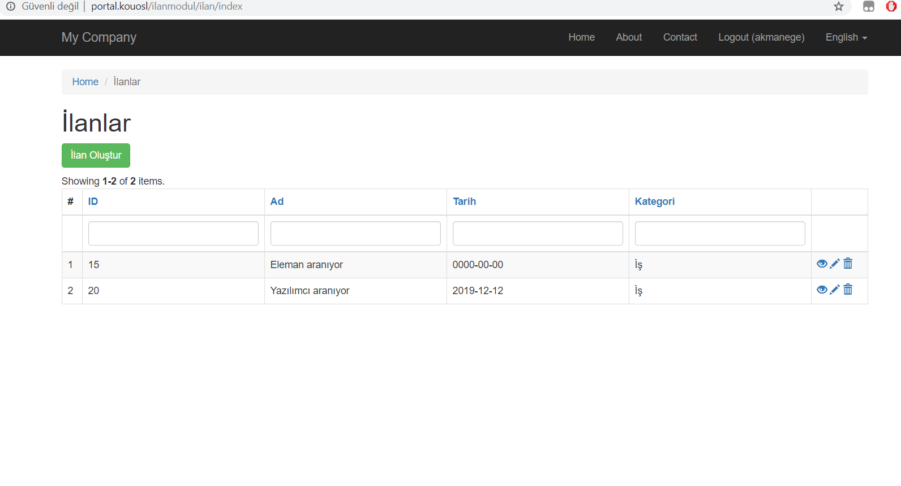
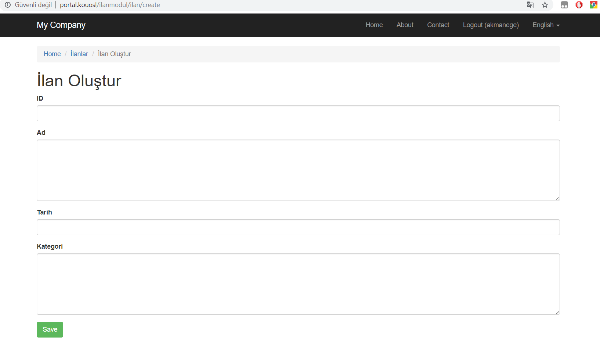
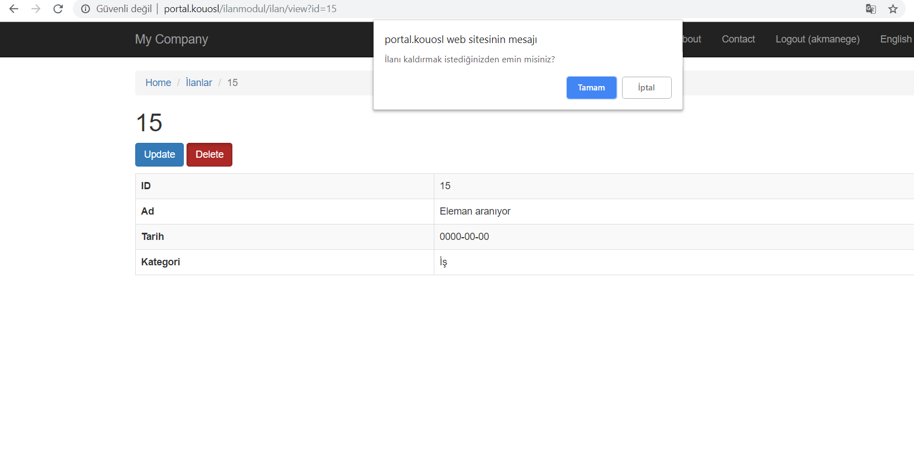

# portal-ilanmodul

# Kurulum
İlan Modulu
Portal İlan modülünü, portal web uygulamasına eklemek için /portal dizininde bulunan composer.json dosyasına gidilerek, aşağıdaki kod parçaları repositories ve require kısımlarına eklenir. Portal dizininde composer update işlemi yapılarak modül yüklenir.

"repositories": [
    {
      
        {
            "type": "vcs",
            "url": "https://github.com/akmanege/portal-ilanmodul.git"
        }
],
"require": {
 
    "kouosl/portal-ilanmodul": "dev-develop"
},

Migrate işlemi için altta bulunan kod parçasının portal dizininde çalıştırılması gerekmektedir.

php yii migrate --migrationPath=@vendor/kouosl/portal-ilanmodul/migrations --interactive=0

# Uygulama

http://portal.kouosl/ilanmodul yazılarak modüller kısmına 
erişim sağlanır.

İlan modülü şeçilerek modül incelenebilir.  

İlan oluştu butonuna basarak ilan oluşturabiliriz.

Düzenleme ve silme işlemleri de gerçekleştirilebilir.

